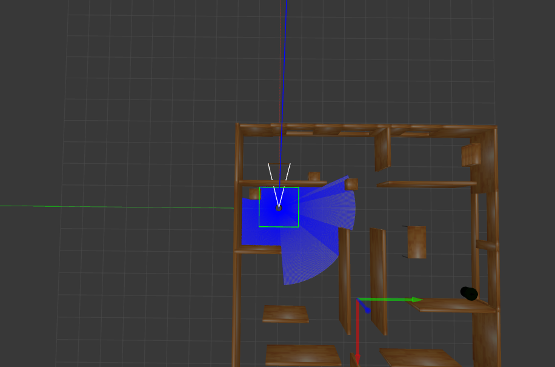

### TO CONVERT IMAGE INTO GRID:
1. place image in raw_image folder
2. run ConvertMap.ipynb
3. result will be saved in /converted_image and grid_txt

### TO GET VISUALISATION OF REBASED COORDINATES (optional):
1. replace the input filename with your grid.txt file name
2. run Coodinates.ipynb and click on one of those blue dots as your new origin

### TO GET 2-D PATH PLANNING VISUALISATION:
1. run python user_input.py and follow prompts to enter robot data, points of interest, charging station, etc. 
2. run python test_bc_tsp.py.

### TO RUN GAZEBO SIMULATION USING BASE ENVIRONMENT (final_path.txt)
1. You first need to install VirtualBox and use the image provided by waveshare:
   https://www.waveshare.com/wiki/UGV_Rover_PI_ROS2_11._Gazebo_Simulation_debugging
2. Once in the virtual machine, you must follow steps on above page to get into docker container, ```xhost +``` and ```. ros_humble.sh```
3. Then copy in the repository with ```docker cp {REPO_PATH} CONTAINER_ID:/home/ws/```
4. Once here, cd to the root of the git respository with ```cd cs1699-EcoBot```
5. Build the ros2 package with ```colcon build``` and ```source install/setup.bash```
6. Open up Gazebo with ```ros2 launch ugv_gazebo bringup.launch.py```
7. Once in Gazebo, you must align the world using the rotate and movement tools in the top toolbar to algin with this image:
   
9. In another terminal window, open up the container again with ```. ros_humble.sh```
10. Now run the rover movement software with ```ros2 run eco_move move.py```

A demo of the rover moving in the base environment can be found at: https://www.youtube.com/watch?v=LqG55MnkGIw&t=38s&ab_channel=RoryMcCann
